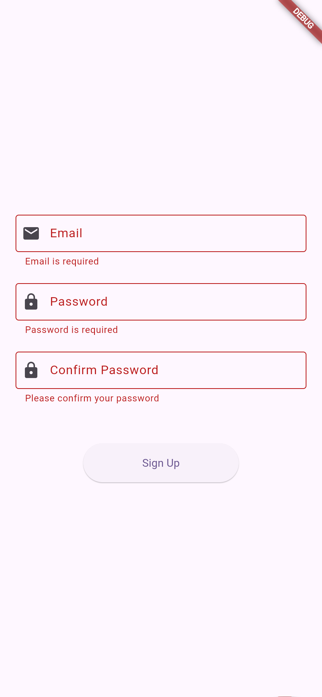

## 📁 Project Breakdown

### 🔸 `sign_up_bloc.dart`
- Manages the core business logic for the sign-up process.
- Contains:
  - **Events**: `UserInitiatedSignUp`, `ResetFormState`, `SubmitSignUpData`.
  - **States**: `InitialSignUpState`, `LoadingSignUpState`, `SignUpCompleted`, `SignUpErrorState`.
- Listens for user actions, validates input, and emits appropriate states based on the result.

---

### 🔸 `form_validator.dart`
- Hosts the `FormValidationHelper` class, which encapsulates form validation logic.
- Includes:
  - `checkEmailFormat(String?)` – Ensures a valid email format is used.
  - `checkPasswordStrength(String?)` – Confirms that the password is strong enough.
  - `checkPasswordMatch(String?, String?)` – Checks if password and confirm password fields match.
  - `runFullValidation(...)` – Performs full-field validation and returns a map of errors keyed by field name.

---

### 🔸 `sign_up_ui_with_bloc.dart`
- This is the UI component for the sign-up screen.
- Integrates with BLoC via `BlocProvider` and `BlocConsumer`.
- Shows real-time feedback using `Fluttertoast` for any errors.
- Displays a loading indicator when processing.
- Navigates to a different screen upon successful registration.

---

## 🧪 How the Validation System Operates

- When the user taps on "Sign Up", the entered data is passed to the validator.
- If any issues are detected, a specific bloc state is triggered containing field-level error messages.
- The UI reacts to these by displaying a toast notification with the first error found.
- If all inputs are valid, the app enters a `Loading` state followed by either a `Success` or `Error` result (e.g., duplicate email).

---

## 🧠 Sample Validation Logic

```dart
class FormValidationHelper {
  static String? checkEmailFormat(String? email) {
    if (email == null || email.trim().isEmpty) return 'Email can\'t be empty';
    if (!RegExp(r'^[\w-\.]+@([\w-]+\.)+[\w-]{2,4}$').hasMatch(email)) return 'Invalid email format';
    return null;
  }

  static String? checkPasswordStrength(String? password) {
    if (password == null || password.isEmpty) return 'Password is required';
    if (password.length < 6) return 'Password too short';
    return null;
  }

  static String? checkPasswordMatch(String? original, String? repeated) {
    if (repeated == null || repeated.isEmpty) return 'Confirmation required';
    if (original != repeated) return 'Passwords mismatch';
    return null;
  }

  static Map<String, String> runFullValidation({
    required String email,
    required String password,
    required String confirmPassword,
  }) {
    final problems = <String, String>{};

    final emailErr = checkEmailFormat(email);
    if (emailErr != null) problems['email'] = emailErr;

    final passErr = checkPasswordStrength(password);
    if (passErr != null) problems['password'] = passErr;

    final matchErr = checkPasswordMatch(password, confirmPassword);
    if (matchErr != null) problems['confirmPassword'] = matchErr;

    return problems;
  }
}
```

---

## ✅ Highlights

- Implements **BLoC** architecture to clearly separate logic from UI.
- Centralized validation logic for maintainability and scalability.
- Multiple BLoC states represent each stage of the sign-up workflow.
- UI responds dynamically to different states using `BlocConsumer`.
- Validation is always performed before processing form data.

---


