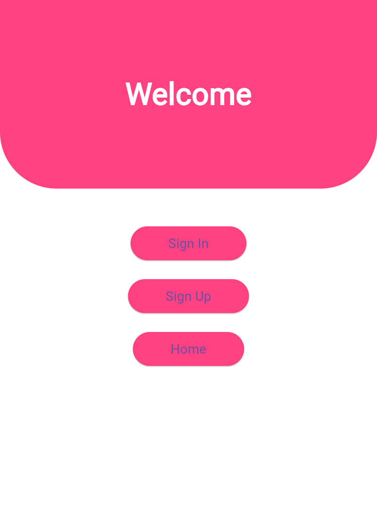
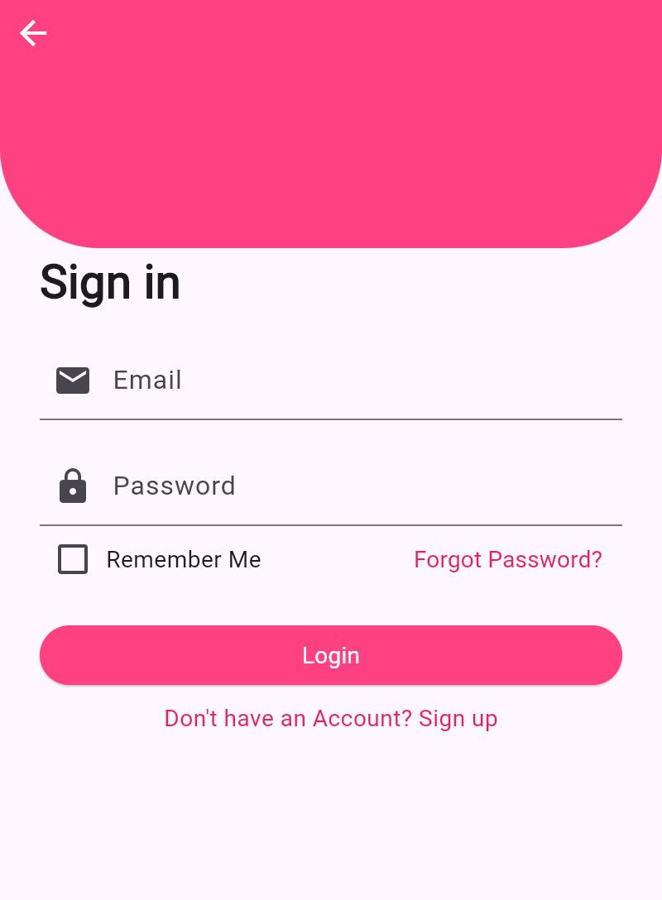
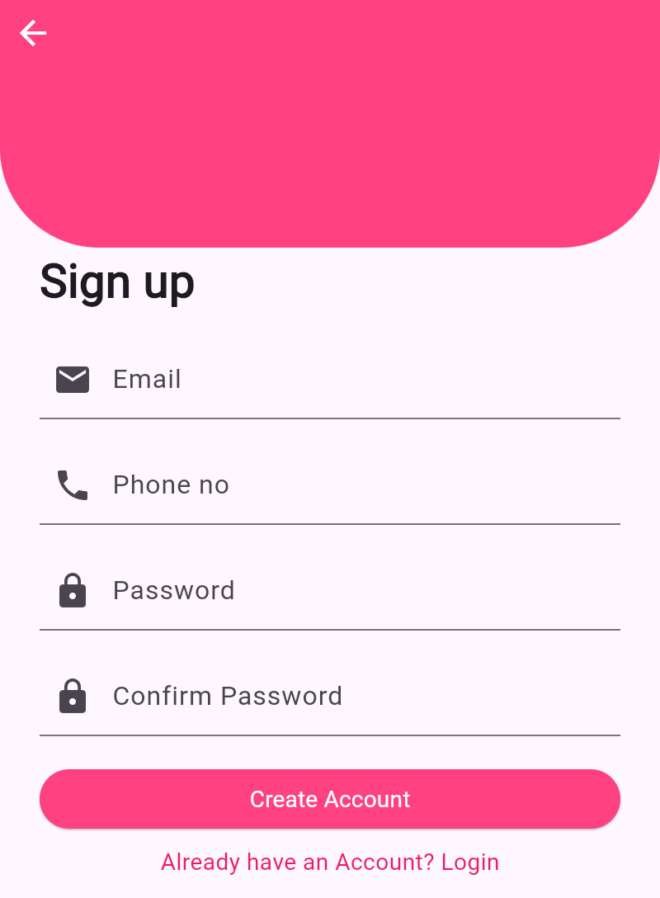
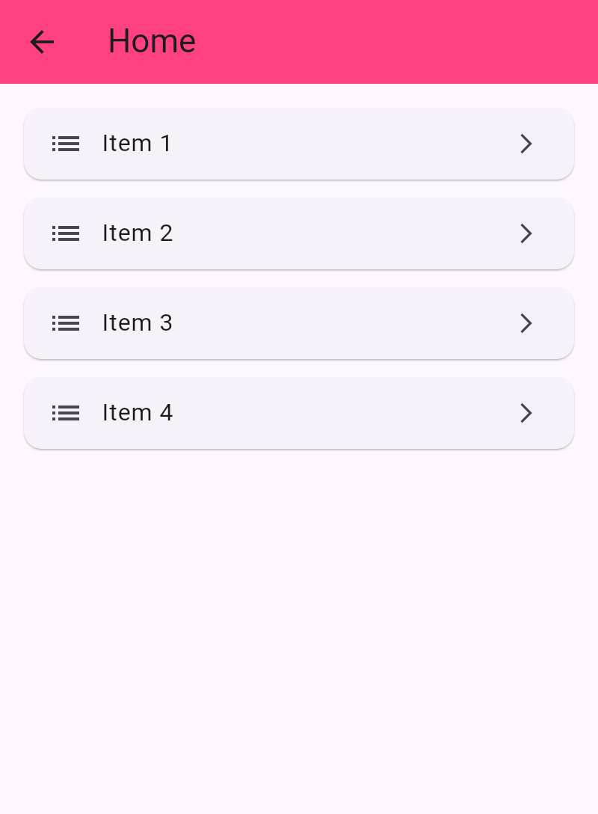

# 📱 Flutter Simple App

This project is a simple Flutter application demonstrating basic navigation between Sign In, Sign Up, and Home screens.

## 🛠️ Features Used

- `MaterialApp` and named routes (`Navigator.pushNamed`)
- `StatelessWidget` and `StatefulWidget`
- Basic navigation using `Navigator`
- ListView implementation on the Home screen
- Custom AppBar with back arrow
- Hover effects using `MouseRegion`

## 📸 Screenshots

<table>
  <tr>
    <td align="center">
       
      <b>Welcome Screen</b>
    </td>
    <td align="center">
       
      <b>Sign In Screen</b>
    </td>
  </tr>
  <tr>
    <td align="center">
       
      <b>Sign Up Screen</b>
    </td>
    <td align="center">
       
      <b>Home Screen</b>
    </td>
  </tr>
</table>
